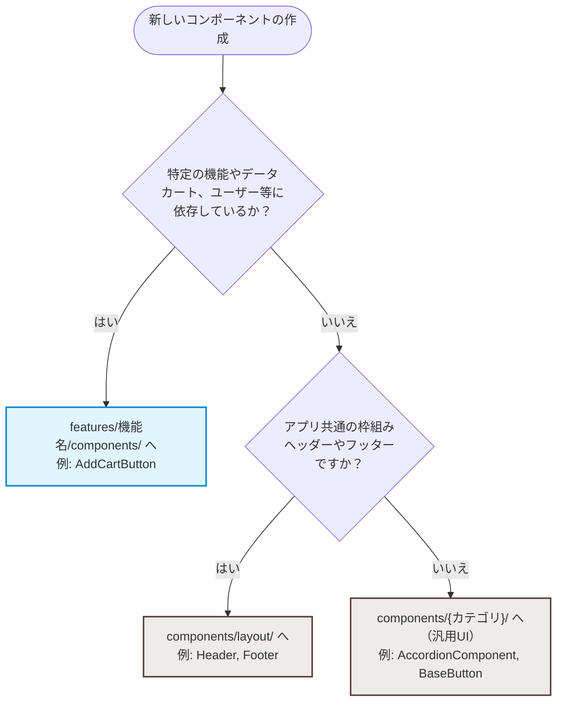

# フロントエンド・アーキテクチャ設計指針

本プロジェクトでは、変更に強く、コードの置き場所を見失わないために、「ドメイン知識（ビジネスロジック）の有無」を基準としたディレクトリ構成を採用しています。

## 依存関係のルール

依存の方向は常に **`components (UI)` ← `features` ← `pages`** の一方向です。

- `components` は `features` や `pages` に依存してはいけません（完全なスタンドアロン）。
- `features` は `pages` に依存してはいけません。
- 逆流する依存（例：`components` から `features` のロジックを呼び出すなど）は禁止です。

---

## ディレクトリ構造と役割

```
.
├── components/       # 【UI】ドメイン知識を持たない、純粋なUIパーツ
├── features/         # 【機能】業務ロジックや特定のドメイン（User, Cart等）に紐づく関心事
├── pages/            # 【画面】ルーティングの対象。components や features を組み合わせて画面を構築
└── composables/      # 【共通ロジック】アプリ全体で使う、ドメイン知識のない汎用フック

```

### 1. components/

特定の業務ロジックを知らない、**「見た目」と「汎用的なインタラクション」だけを担当する**コンポーネントを配置します。

- **特徴:** 原則として、Propsでデータを受け取り、Emitsでイベントを通知する（外部のAPI通信やグローバルな状態管理には直接触れない）。
- **主なサブディレクトリ:**
- `button/`: `BaseButton.vue` など
- `dialog/`: `BaseDialog.vue`, `DeleteConfirmDialog.vue`（※文脈のない汎用削除ダイアログ）など
- `layout/`: `Header.vue`, `Footer.vue`（アプリ共通の枠組み）
- `common/`: `AccordionComponent.vue`, `ColorSelector.vue`（※単に色を選択してemitするだけの実装）など

### 2. features/

「ユーザー」「カート」「商品」など、**特定の業務ドメインやビジネスロジックを担当する**コードを配置します。コンポーネントだけでなく、その機能専用のロジック（composables）もこの中に閉じ込めます。

- **特徴:** 内部でAPI通信を行ったり、特定の状態（Pinia等）を操作したりしてよい。
- **構造例:**

```
features/
└── cart/
    ├── components/
    │   ├── CartDetail.vue
    │   ├── CartSummary.vue
    │   └── AddCartButton.vue  # カート投入APIを呼ぶボタンはここ！
    └── composables/
        └── useCart.ts         # カートに関するロジック

```

### 3. pages/

Vue Router（またはNuxt）のマッピング先となる、各画面のルートコンポーネントです。
原則として、ここでは厚いロジックは書かず、`features` や `components` をパズルのように配置して「画面のレイアウト」を整えることに専念します。

---

## 【開発者向け】コンポーネントの置き場所に迷ったら？

新しいコンポーネントを作る際、どこに置くべきかは以下のフローで判断してください。



### 具体的な迷いどころFAQ

**Q. `AddCartButton.vue` はボタンだから `components/button/` じゃないの？**
**A. `features/cart/` に置きます。**
このボタンは「カートに商品を追加する」という具体的なビジネスロジック（APIを叩く、カートの状態を更新するなど）を知っているため、`features` に属します。実装時は、`features/cart/AddCartButton.vue` の中で、汎用UIである `components/button/BaseButton.vue` を呼び出す形にしてください。

**Q. `ColorSelector.vue` はどこ？**
**A. 仕様（文脈）によって変わります。**

- 単にカラーコードの配列を受け取って、選ばれた色を `emit` するだけの汎用的なUIパーツなら ──> `components/common/ColorSelector.vue`
- 「選択された商品の在庫のある色をAPIから取得して表示する」ようなビジネスロジックを含むなら ──> `features/product/components/ColorSelector.vue`

**Q. `FileUploadArea.vue`（ドラッグ＆ドロップ領域）はどこ？**
**A. `components/form/FileUploadArea.vue` に置きます（汎用UI）。**
このコンポーネント自体は「ファイルが選択されたこと」を `emit` で親に伝えるだけの役割（汎用UI）にします。
実際に「アップロードされたファイルをAPIに送信する」というビジネスロジックは、このコンポーネントを呼び出す側（例：`features/user/components/UserImportDialog.vue` や 各画面の `pages/`）に記述します。
これによって、同じアップロード見た目を「ページ直置き」でも「ダイアログ内」でも使い回せるようになります。
